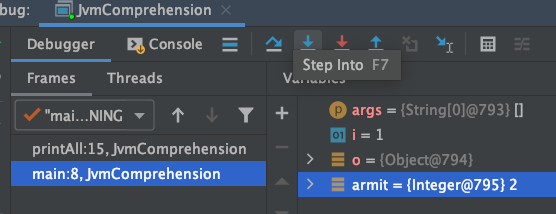
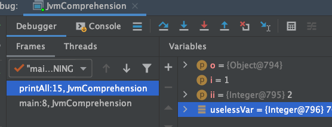
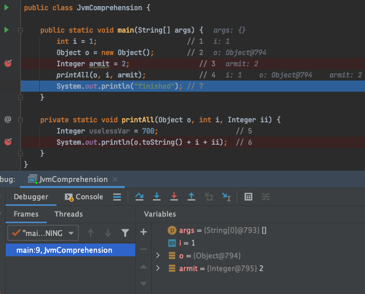
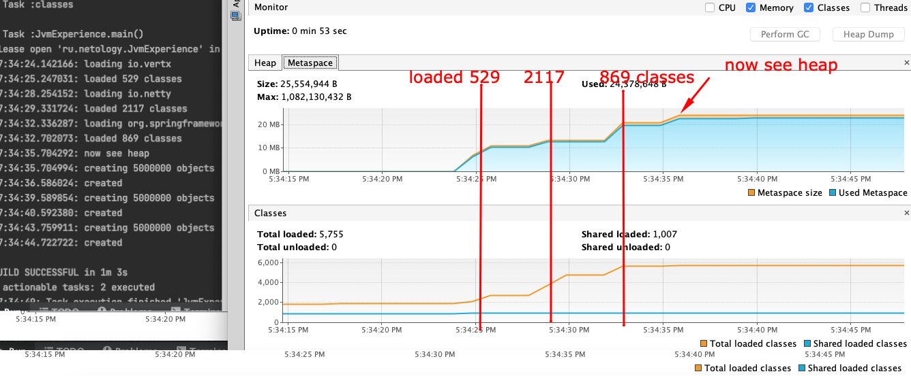
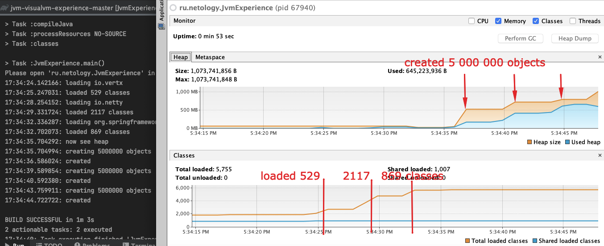

# Task 1
JVM Comprehension

```java
public class JvmComprehension {

    public static void main(String[] args) {
        int i = 1;                      // 1
        Object o = new Object();        // 2
        Integer ii = 2;                 // 3
        printAll(o, i, ii);             // 4
        System.out.println("finished"); // 7
    }

    private static void printAll(Object o, int i, Integer ii) {
        Integer uselessVar = 700;                   // 5
        System.out.println(o.toString() + i + ii);  // 6
    }
}
```
0. Пререквизит: утилита javac из .java файл сформирует файлы .class, содержащие исполняемый байткод.  В нашем случае это будет один файл с названием JvmComprehension.
1. Начинают работу ClassLoader'ы.  Очередность работы с учетом делегирования следующая: Application CL -> Platform CL -> Bootstrap CL и обратно . В нашем случае Application ClassLoader осуществит загрузку класса в JVM. 
2. В JVM класс загружается в 3 области памяти:
	- **Metaspace**: содержит метаданные о классах имена, методы, поля и константы.
	- **Heap**: хранит экземпляры классов, в частности  экземпляр Object, Integer ii, uselessVar 
	- **Stack**: содежит исполняемые фреймы вызываемых методов. Фреймы в свою очередь содержат данные связанные/ необходимые для самого метода  включая примитивные переменные их значения и переменные ссылочного типа со ссылками на Heap. В нашем случае будет 2 фрейма:
	- main
	- printAll

3. Heap освобождается по факту завершения исполнения метода, к примеру:


4. Сборщик мусора отрабатывает после остановки исполнения всего кода из примера. Это можно заметить наблюдая за состоянием Heap в IDE IntellJ
   , т.е после выполнения кода в Heap ничего не доступно. 

# Task 2
Размеченные картинки по выведенным событиям в консоли IDE:



Общее описание:
1. При прогрузке классов видна тенденция увеличения Metaspace, в то время как размер обрасти Heap не изменяется.
2. При создании же экземпляров объекта можно наблюдать обратную ситуацию, т.е размер Metascape не изменяется, так как метаданные классов из которых непосредственно создаются экземпляры объектов уже прогруженны, в то время как размер Heap растет с увеличением количества создаваемых объектов. 
